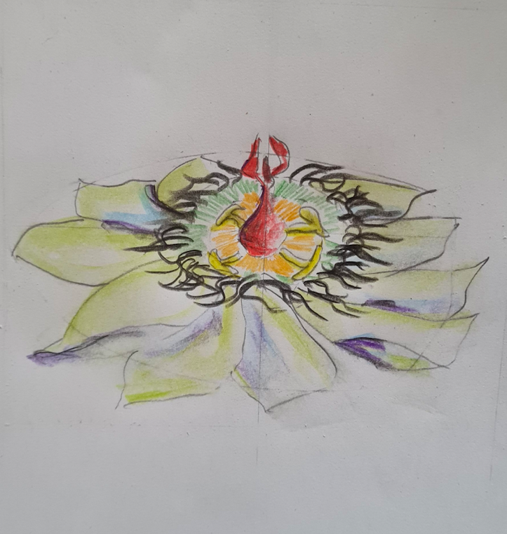

# David Deutsch Meditations

This repository presents text files that reflect and meditate on various aspects of the worldview from David Deutsch's works "The Fabric of Reality: The Science of Parallel Universes" and "The Beginning of Infinity: Explanations that Transform The World ". Each text file is standalone and deals with a specific topic or idea from the books mentioned.

## Content

The texts in this repository offer individual meditations and reflections on the concepts and theories of David Deutsch. You can browse through the different files and select the ones that pique your interest.

**Note:** This repository is for educational purposes and discussion of ideas only. It was created by fans and interested parties and has no official connection to David Deutsch or his publishers.
